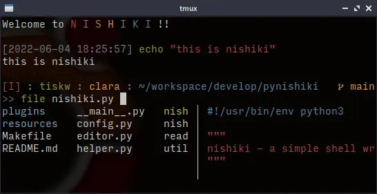

<div align="center">
  
</div>

NiShiKi - a simple shell wrapper
====================================================================================================

<p align="center">
     &nbsp;
     &nbsp;
    
</p><p align="center">
    <a href="#features">Features</a> &nbsp;&bull;&nbsp;
    <a href="#installation">Installation</a> &nbsp;&bull;&nbsp;
    <a href="#usage">Usage</a> &nbsp;&bull;&nbsp;
    <a href="#for-developers">For developers</a> &nbsp;&bull;&nbsp;
    <a href="#gratitude">Gratitude</a> &nbsp;&bull;&nbsp;
    <a href="#license">License</a>
</p>

NiShiKi is a simple shell wrapper for UNIX-like OS, such as Debian, Ubuntu, and WSL. It has
real-time completion functions to assist user command editing, and all completions are customizable
by a user-defined config file. NiShiKi's completions tend to be more extensive than other famous
shells such as [Bash](https://www.gnu.org/software/bash/), [Zsh](https://www.zsh.org/), and
[Fish](https://fishshell.com/). Although NiShiKi's completions can be customized, it's difficult to
reduce the amount of completions by the customization. Therefore, if you feel NiShiKi's completions
are too noisy, it's better to use Bash or something similar.

Note that NiShiKi is NOT a shell, just a shell wrapper to make command editing works easier.
Input commands are processed by your background shell.

For more information, please visit [the online document](https://tiskw.github.io/nishiki/).

<div align="center">
  
</div>


Features
----------------------------------------------------------------------------------------------------
  
- **Simple**: NiShiKi is provided as C++ source code that can be compiled easily by common build
  tools (e.g. G++ and Make), and the source code of NiShiKi is designed not to exceed 3,000
  effective rows excluding comment lines, empty lines, and the configuration file.
- **Extensible**: NiShiKi is customizable (e.g. propmt strings, command aliases, keybindings, etc.)
  through the config file, or writing a short external software in any language you like.
- **Fast**: NiShiKi is written in C++ and carefully designed to be fast enough for supporting
  user's command editing work.


Installation
----------------------------------------------------------------------------------------------------

See [the getting started section of the online document](https://tiskw.github.io/nishiki/index.html#getting-started).
The following is a summary of the installation process on Ubuntu using the Clang compiler.

```console
# Install GNU C++ compiler, make and ncurses library.
sudo apt install g++ make libncurses-dev

# Build NiShiKi.
make

# Copy the NiShiKi binary to "~/bin" and config files to "~/.config/nishiki".
make install
```


Usage
----------------------------------------------------------------------------------------------------

The usage of NiShiKi is almost the same as the other shells, just type a command and hit enter key.

As an example, launch `nishiki` in the root directory of this repository that you've cloned,
and please type `git diff README.md`. You can enjoy various types of command completions provided
by `nishiki` while typing the words. A list of completion candidates is shown under your editing
line, and if the number of candidates is only one, you can complete it by typing the `TAB` key.
For example, `git d<TAB>` results in `git diff` and also, `git diff R<TAB>` results in
`git diff README.md`.

For more details about the usage of NiShiKi,
see [the online document](https://tiskw.github.io/nishiki/index.html#usage).


For Developers
----------------------------------------------------------------------------------------------------

### Additional preparations

You need to install the following packages to run `make check`, `make count` and `make test`.

```console
apt install cloc cppcheck lcov
```

### Test and coveerage measurement

Our code provides a procedure to test NiShiKi and measure the coverage of the source code.
See [the online document](https://tiskw.github.io/nishiki/test_and_coverage.html)
for more details.


Gratitude
----------------------------------------------------------------------------------------------------

* This software uses the following libraries. I appreciate their devoted contribution
  to these libraries.
  - [cxxopts](https://github.com/jarro2783/cxxopts):
    lightweight but enough rich command line parser (MIT license).
  - [glob](https://github.com/p-ranav/glob):
    Glob pattern matching for C++17 (MIT license).
  - [PocketPy](https://github.com/pocketpy/pocketpy):
    Portable Python 3.x interpreter, written in C11 (MIT license).

* And, of course, [C/C++](https://isocpp.org/) and [Bash](https://www.gnu.org/software/bash/)
  maintainers. NiShiKi is written in C/C++, and utility scripts like build script are written in
  Bash.

* The author also would appreciate the [Nim language](https://nim-lang.org/) maintainers. Because
  the first version of NiShiKi was written in the Nim language. The author learned a lot from it.


License
----------------------------------------------------------------------------------------------------

This software is released under [MIT license](LICENSE.md).


Author
----------------------------------------------------------------------------------------------------

Tetsuya Ishikawa ([EMail](mailto:tiskw111@gmail.com), [Website](https://tiskw.github.io/about_en.html))
