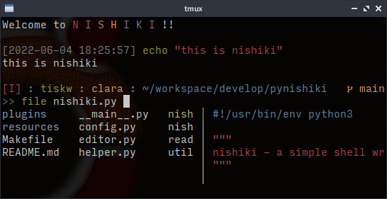

NiShiKi - a simple shell wrapper
====================================================================================================

NiShiKi is a simple shell wrapper for Unix-like OS.
It has real-time completion functions to assist user command editing,
and all completions are customizable by a user-defined config file.
Also, you can extend by writing an external plugin software by your favorite language.

Note that NiShiKi is NOT a shell, just a shell wrapper to make command editing works easier.
Input commands are processed by your background shell.

For more information, please visit the
[online document](https://tiskw.gitbook.io/nishiki-online-document/).

<div align="center">
  
</div>


Features
----------------------------------------------------------------------------------------------------

- **Simplicity:** NiShiKi is written in [Python language](https://www.python.org/) and depends
  only on the standard library of Python. The source code of `nishiki` is designed not to exceed
  500 effective rows (exclude comment lines, empty lines, and configuration files).
- **Extensibility:** NiShiKi is customizable through modifying config file, or writing a short
  external software in any language as you like.
- **Reusability:** The editing interface of NiShiKi is completely separated as `readcmd` module
  and reusable for the other software.


Installation
----------------------------------------------------------------------------------------------------

See the [getting started page of the online document](https://tiskw.gitbook.io/nishiki-online-document/getting-started).
The following is a short summary of the installation process on Ubuntu.

### Install Python interpreter

See the [official installation guide](https://wiki.python.org/moin/BeginnersGuide/Download).
The following is an example to install Python on Ubuntu 20.04 from terminal:

```console
apt install python3
```

### Install dependent packages

You need to install `git`, `zip`, and `highlight` command for running NiShiKi.
The following is an example to install these commands on Ubuntu 20.04 from terminal:

```console
apt install git zip highlight
```

### Download compiled package

TBD.

### Compile from source (optional)

```console
git clone https://github.com/tiskw/nishiki.git
cd nishiki
make
```

The above command will generate a zipped file `nishiki` with executable permission.
Then, place the zip file `nishiki` to somewhere as you want (e.g. `/usr/local/bin`, `~/bin`, etc).


Usage
----------------------------------------------------------------------------------------------------

Usage of NiShiKi is almost the same as the other shells, just type command and hit enter key.

As an example, launch `nishiki` in the root directory of this repository which you've cloned,
and please type `git diff README.md`. You can enjoy variety types of command completions provided
by `nishiki` while typing the command. A list of completion candidates is shown under your
editing line, and if the number of candidates is only one, you can complete it by typing `TAB`
key. For example, `git d<TAB>` results in `git diff ` and also, `git diff R<TAB>` results in
`git diff README.md`.

For more details about the usage of NiShiKi, see the
[online document](https://tiskw.gitbook.io/nishiki-online-document/getting-started).


Gratitude
----------------------------------------------------------------------------------------------------

- To [Python](https://www.python.org/) maintainers. Python has nicely balanced brevity and speed
  which highly contribute to the simplicity of NiShiKi.
- To [Bash](https://www.gnu.org/software/bash/), [Zsh](https://www.zsh.org/),
  [Fish](https://fishshell.com/) and the other famouse shell developers.
  The author learned a lot from these shells.
- To [Nim language](https://nim-lang.org/) maintainers. Because the first versino of NiShiKi
  was written by Nim language. The author learned a lot from the first version of NiShiKi.


License
---------------------------------------------------------------------------------------------------

[MIT Licence](https://opensource.org/licenses/mit-license.php)


Author
---------------------------------------------------------------------------------------------------

* Tetsuya Ishikawa ([EMail](mailto:tiskw111@gmail.com), [Website](https://tiskw.github.io/about_en.html))
