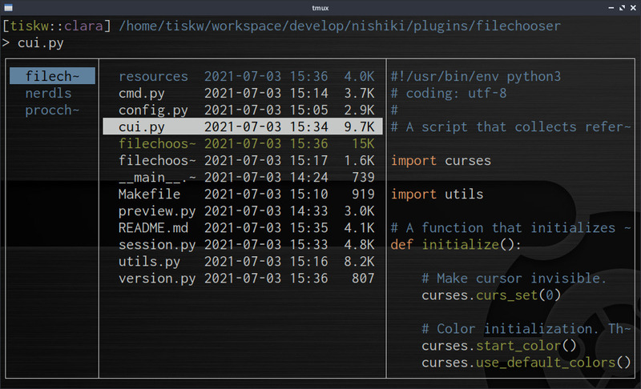

filechooser - file/directory path selection plugin
====================================================================================================

* Start curses interface for selecting file paths, and print it to STDOUT
* Source code preview with syntax highlight
* Works smoothly even on a large directory (e.g. contains 10,000 files)
* Preview of image/video header information
* Vi-like keybindings (but customizable)

<div align="center">
  
</div>


Preparation
---------------------------------------------------------------------------------------------------

This software needs Python3. If you don't have one, please install it.
* Python3: 3.6.0 or newer (because this software uses f-string and `typing.NamedTuple`)

Besides, the following package is required for rich preview:
* Highlight
* Mediainfo
* zip/unzip
* 7Zip

If your OS is Ubuntu 20.04, you can install them by the following command:

```console
$ sudo apt install python3
$ sudo apt install highlight zip unzip p7zip mediainfo
```


Installation
---------------------------------------------------------------------------------------------------

### Pre-build package

No pre-built package available yet, sorry. Please build from source.

### Build from source

Users can build from source by the following command at this directory:

```console
$ make
```

Then, a executable file `filechooser` will be generated.
Please place the file to an appropriate directory
(e.g. `/usr/local/bin/`, `$HOME/bin/`, `.config/nishiki/plugins/`, etc).


Usage
---------------------------------------------------------------------------------------------------

### Use as a Nishiki plugin

Place the file `filechooser` to `~/.config/nishiki/plugins/`, and
add the following line to your `~/.config/nishiki/rc.ini`:

```dosini
[Keybinds]
^F = ":plugin:filechooser"
```

The `^F` (= Ctrl-F) is a key mapping to launch the file chooser. Please change it as  you like.


## Customize key bindings

Users can customize key bindings by changing the source code a bit and rebuild
(just like [dwm](https://dwm.suckless.org/)).
The procedure of key binding customization is quite simple, (1) edit `const.py`, and (2) rebuild.
The outline of the procedure is as follows:

```console
$ cd [THIS DIRECTORY]
$ vi const.py
$ make
```

### (1) Edit const.py

The dictionary `Config.commands` which defines key bindings of the file chooser is defined in the `const.py`.
You can change the key bindings by changing the key of these dictionaries.

For example, you can see that the key `G` of the dictionary `commands` is mapped to
`"cmd.mode_to_bottom"` which means the function to move to the bottom of the list, like the following.

```python
class Config(typing.NamedTuple):
    ...
    commands: dict = {
        "G" : "cmd.move_to_bottom",
        ...
    }
```

By changing the key `G` to `+` in the above code, you can move to the bottom of the list by the key `+`,
and the key binding `G` is released.

```python
class Config(typing.NamedTuple):
    ...
    commands_filer: dict = {
        "+" : "cmd.move_to_bottom",
        ...
    }
```

### (2) Rebuild

You can rebuild the file chooser by just running `make` command:

```console
$ make
```

### Default key bindings

| Command | Description                            |
| ------- | -------------------------------------- |
| `G`     | move to the bottom of the list         |
| `d`     | move down the cursor more              |
| `h`     | move to the previous directory         |
| `j`     | move down the cursor                   |
| `k`     | move up the cursor                     |
| `l`     | move to the selected directory         |
| `q`     | quit                                   |
| `r`     | refresh directory                      |
| `s`     | switch to process index selection mode |
| `u`     | move up the cursor more                |
| `0`     | move to the top of the list            |
| `C-b`   | move up the cursor more                |
| `C-f`   | move down the cursor more              |
| `C-j`   | finish file selection                  |
| `C-k`   | select current directory and finish    |
| `C-p`   | toggle show/no-show preview window     |
| `-`     | move to the previous directory         |
| `.`     | toggle show/no-show dot file           |
| `$`     | move to the bottom of list             |
| `/`     | enter to the grep mode                 |
| `ENTER` | finish file selection and quit         |
| `SPACE` | toggle select/unselect                 |


License
---------------------------------------------------------------------------------------------------

[MIT Licence](https://opensource.org/licenses/mit-license.php)


Author
---------------------------------------------------------------------------------------------------
 
* Tetsuya Ishikawa ([EMail](mailto:tiskw111@gmail.com), [Website](https://tiskw.github.io/about_en.html))
