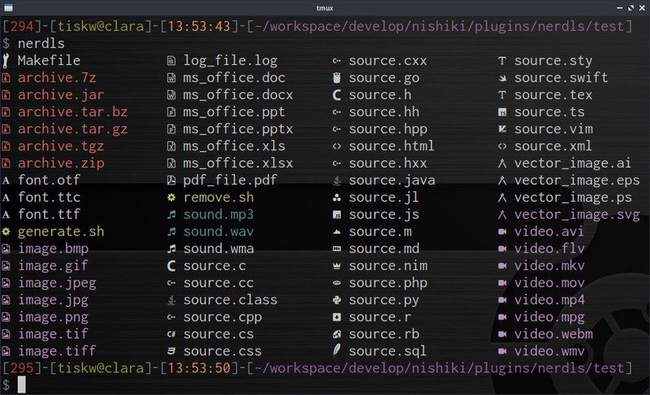

nerdls
====================================================================================================

`nerdls` is a `ls`-like command with extra decoration
using [Nerd Font](https://www.nerdfonts.com/).

<div align="center">
  
</div>


Installation
---------------------------------------------------------------------------------------------------

### Pre-built package

No pre-built package available yet, sorry. Please build from source.

### Build from source

Build from source by the following command, and place the output binary file `nerdls` to
an appropriate directory (e.g. `/usr/local/bin/`, `$HOME/bin/`, `.config/nishiki/plugins/`, etc).

```console
$ nim compile -d:release nerdls.nim
```

### Nerd font

For using `nerdls`, you also need to install [Nerd Font](https://www.nerdfonts.com/),
and configure your terminal emurator to use the font. Installation of Nerd Font is easy,
download the true type version of Nerd Font from
[the official download page](https://www.nerdfonts.com/font-downloads), unzip it and place
the files under `/user/fonts/truetype/` (e.g. `/user/fonts/truetype/nerdfont`), and run `fc-cache`.

Then, configure your terminal emurator to use the font. The configuration procedure highly depends
on the terminal emulator you are using. Please see documents of your terminal emulator.


Usage
---------------------------------------------------------------------------------------------------

### Use as a standalone command

Place the binary file `nerdls` to a directory that is registered in `PATH`,
then, just use `nerdls` instead of `ls`.

### Use as a Nishiki plugin

Place the binary file `nerdls` to `~/.config/nishiki/plugins/`, and
add the following line to your `~/.config/nishiki/rc.ini`:

```dosini
[Listdir]
ls_command = ":plugin:nerdls"
```


Command line options
---------------------------------------------------------------------------------------------------

### Compatible options with GNU `ls`

| Option                      | Description                                                                |
| :-------------------------- | :------------------------------------------------------------------------- |
| `-1`, `--one`               | Print one file per line.                                                   |
| `-a`, `--all`               | Do not ignore entries starting with dot.                                   |
| `-d`, `--directory`         | List directories themselves, not their contents.                           |
| `-h`, `--human-readable`    | Show file size in a human-readable format.                                 |
| `-l`, `--long`              | Print with long listing format.                                            |
| `-r`, `--reverse`           | Reverse order while sorting.                                               |
| `-R`, `--recursive`         | List subdirectories recursively.                                           |
| `--group-directories-first` | Group directories before files.                                            |
| `--color=WHEN`              | Enable/disable colorization, where `WHEN` is `auto`, `always`, or `never`. |

### Unique options

| Option            | Description                        |
| :---------------- | :--------------------------------- |
| `--ignopterr`     | Ignore all undefined option error. |
| `--maxfiles=int`  | Max number of files to be listed.  |
| `--noicons`       | Disable icons.                     |


### Help options

| Option            | Description                        |
| :---------------- | :--------------------------------- |
| `-?`, `--help`    | Show help message and exit.        |
| `-v`, `--version` | Show version information and exit. |


Customize colorization
---------------------------------------------------------------------------------------------------

Users can customize colorization by setting `LS_COLORS_NERD` environment variable
(just like `LS_COLORS` in GNU `ls` command).

* `LS_COLORS_NERD` is a list of tokens separated by `:`.
* The format of tokens in `LS_COLORS_NERD` is `PROPERTY=COLOR`.
* See the following table for the details of `PROPERTY`.
* The `COLOR` above is an ASCII color sequence. For example, if `COLOR` is `01;31`, then the corresponding color is `\x1b[01;31m`.
* The first matched color will be applied.

| Property | Description                     |
| :------- | :------------------------------ |
| `rs`     | Reset to ordinary color         |
| `bd`     | Block device                    |
| `cd`     | Char device                     |
| `fi`     | Regular file                    |
| `di`     | Directory                       |
| `ex`     | Executable                      |
| `ln`     | Symlink                         |
| `no`     | Normal                          |
| `ow`     | Other-writable                  |
| `pi`     | Pipe                            |
| `so`     | Socket                          |
| `*.ext`  | File which has extension `.ext` |

The following is a default value of the `LS_COLORS_NERD`.

```nim
let DEFAULT_LS_COLORS_NERD: string = """
rs=0:no=:ln=01;36:bd=40;33;01:cd=40;33;01:pi=40;33:so=01;35:ow=30;42:di=01;34:ex=01;32:
*.tar=01;31:*.tgz=01;31:*.arc=01;31:*.arj=01;31:*.taz=01;31:*.lha=01;31:*.lz4=01;31:
*.lzh=01;31:*.lzma=01;31:*.tlz=01;31:*.txz=01;31:*.tzo=01;31:*.t7z=01;31:*.zip=01;31:
*.z=01;31:*.dz=01;31:*.gz=01;31:*.lrz=01;31:*.lz=01;31:*.lzo=01;31:*.xz=01;31:*.zst=01;31:
*.tzst=01;31:*.bz2=01;31:*.bz=01;31:*.tbz=01;31:*.tbz2=01;31:*.tz=01;31:*.deb=01;31:*.rpm=01;31:
*.jar=01;31:*.war=01;31:*.ear=01;31:*.sar=01;31:*.rar=01;31:*.alz=01;31:*.ace=01;31:*.zoo=01;31:
*.cpio=01;31:*.7z=01;31:*.rz=01;31:*.cab=01;31:*.wim=01;31:*.swm=01;31:*.dwm=01;31:*.esd=01;31:
*.jpg=01;35:*.jpeg=01;35:*.mjpg=01;35:*.mjpeg=01;35:*.gif=01;35:*.bmp=01;35:*.pbm=01;35:*.pgm=01;35:
*.ppm=01;35:*.tga=01;35:*.xbm=01;35:*.xpm=01;35:*.tif=01;35:*.tiff=01;35:*.png=01;35:*.svg=01;35:
*.svgz=01;35:*.mng=01;35:*.pcx=01;35:*.mov=01;35:*.mpg=01;35:*.mpeg=01;35:*.m2v=01;35:*.mkv=01;35:
*.webm=01;35:*.ogm=01;35:*.mp4=01;35:*.m4v=01;35:*.mp4v=01;35:*.vob=01;35:*.qt=01;35:*.nuv=01;35:
*.wmv=01;35:*.asf=01;35:*.rm=01;35:*.rmvb=01;35:*.flc=01;35:*.avi=01;35:*.fli=01;35:*.flv=01;35:*.gl=01;35:
*.dl=01;35:*.xcf=01;35:*.xwd=01;35:*.yuv=01;35:*.cgm=01;35:*.emf=01;35:*.ogv=01;35:*.ogx=01;35:*.aac=00;36:
*.au=00;36:*.flac=00;36:*.m4a=00;36:*.mid=00;36:*.midi=00;36:*.mka=00;36:*.mp3=00;36:*.mpc=00;36:*.ogg=00;36:
*.ra=00;36:*.wav=00;36:*.oga=00;36:*.opus=00;36:*.spx=00;36:*.xspf=00;36:
""".replace("\n", "")
```


Customize file icons
---------------------------------------------------------------------------------------------------

TBD.

See the [cheet sheet of Nerd Font](https://www.nerdfonts.com/cheat-sheet) for finding a hex code of icon.


License
---------------------------------------------------------------------------------------------------

[MIT Licence](https://opensource.org/licenses/mit-license.php)


Author
---------------------------------------------------------------------------------------------------

* Tetsuya Ishikawa ([EMail](mailto:tiskw111@gmail.com), [Website](https://tiskw.github.io/))
