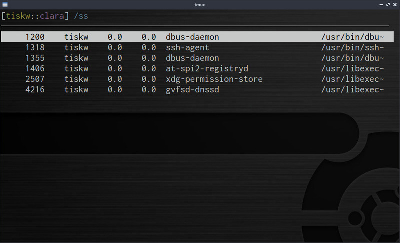

textchooser - multi purpose text selection plugin
====================================================================================================

* Start curses interface for selecting text from a given text list, and print it to STDOUT
* Works smoothly even on a huge number of texts (e.g. 10,000 lines)
* Vi-like keybindings (but customizable)

<div align="center">
  
</div>


Preparation
---------------------------------------------------------------------------------------------------

This software needs Python3. If you don't have one, please install it.
* Python3: 3.6.0 or newer (because this software uses f-string and `typing.NamedTuple`)

If your OS is Ubuntu 20.04, you can install them by the following command:

```console
sudo apt install python3
```


Installation
---------------------------------------------------------------------------------------------------

### Pre-build package

No pre-built package available yet, sorry. Please build from source.

### Build from source

Users can build from source by the following command at this directory:

```console
make
```

Then, a executable file `procchooser` will be generated.
Please place the file to an appropriate directory
(e.g. `/usr/local/bin/`, `$HOME/bin/`, `.config/nishiki/plugins/`, etc).

### Install for Nishiki

If you are going to use `textchooser` as a plugin of Nishiki,
please put the file `textchooser` to `.config/nishiki/plugins/`.
You can do that just type

```console
make install
```


Usage
---------------------------------------------------------------------------------------------------

### Use as a Nishiki plugin

Add the following line to your configuration file (e.g. `~/.config/nishiki/rc.ini`):

```dosini
[Keybinds]
"^P" = "~/.config/nishiki/plugins/textchooser -o /tmp/nishiki/plugin_tmp_dump.txt -c 'ps aux --no-header' -f 1"
```

The `^P` (= Ctrl-P) is a key mapping to launch the process ID chooser. Please customize it as you like.


Customize key bindings
---------------------------------------------------------------------------------------------------

Users can customize key bindings by changing the source code a bit and rebuild
(just like [dwm](https://dwm.suckless.org/)).
The procedure of key binding customization is quite simple, (1) edit `const.py`, and (2) rebuild.
The outline of the procedure is as follows:

```console
$ cd [THIS DIRECTORY]
$ vi const.py
$ make
```

### (1) Edit const.py

The dictionary `Config.commands` which defines key bindings of the process chooser is defined in the `const.py`.
You can change the key bindings by changing the key of these dictionaries.

For example, you can see that the key `G` of the dictionary `commands` is mapped to
`"cmd.mode_to_bottom"` which means the function to move to the bottom of the list, like the following.

```python
class Config(typing.NamedTuple):
    ...
    commands: dict = {
        "G" : "cmd.move_to_bottom",
        ...
    }
```

By changing the key `G` to `+` in the above code, you can move to the bottom of the list by the key `+`,
and the key binding `G` is released.

```python
class Config(typing.NamedTuple):
    ...
    commands_filer: dict = {
        "+" : "cmd.move_to_bottom",
        ...
    }
```

### (2) Rebuild

You can rebuild the file chooser by just running `make` command:

```console
$ make
```

### Default key bindings

| Command | Description                            |
| ------- | -------------------------------------- |
| `/`     | start filtering mode                   |
| `d`     | move down the cursor more              |
| `j`     | move down the cursor                   |
| `k`     | move up the cursor                     |
| `q`     | quit                                   |
| `u`     | move up the cursor more                |
| `C-b`   | move up the cursor more                |
| `C-j`   | finish process number selection        |
| `ENTER` | finish process number selection        |
| `SPACE` | toggle select/unselect                 |


License
---------------------------------------------------------------------------------------------------

[MIT Licence](https://opensource.org/licenses/mit-license.php)


Author
---------------------------------------------------------------------------------------------------

* Tetsuya Ishikawa ([EMail](mailto:tiskw111@gmail.com), [Website](https://tiskw.github.io/about_en.html))
